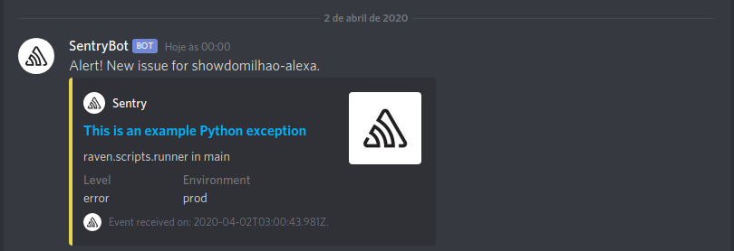

<h1 align="center">
    
</h1>

<h4 align="center">
  🚀 Sentry - Discord
</h4>

  <a href="#book-introduction">Introduction</a>&nbsp;&nbsp;&nbsp;|&nbsp;&nbsp;&nbsp;
  <a href="#scroll-setup">Setup</a>&nbsp;&nbsp;&nbsp;|&nbsp;&nbsp;&nbsp;
  <a href="#notebook-discord">Discord</a>&nbsp;&nbsp;&nbsp;|&nbsp;&nbsp;&nbsp;
  <a href="#hammer-hosting">Hosting</a>&nbsp;&nbsp;&nbsp;|&nbsp;&nbsp;&nbsp;
  <a href="#rocket-deploy">Deploy</a>&nbsp;&nbsp;&nbsp;|&nbsp;&nbsp;&nbsp;
  <a href="#star2-sentry">Sentry</a>

# :book: Introduction

This is an API for receiving Sentry's Webhook alerts and converting it into a suitable format to be sent as a message to Discord.

<h1 align="center">
    
</h1>

## :scroll: Setup

To configure alerts from Sentry to Discord, you need to follow the steps below.

## :notebook: Discord

Find the Discord channel in which you would like to send your alerts.

In the settings for that channel, find the Webhooks option and create a new webhook. Note: Do NOT give this URL out to the public. Anyone or service can post messages to this channel, without even needing to be in the server. **Keep it safe!**

## :hammer: Hosting

For this example, I will use Heroku, a free service hosting platform.

First, open the Heroku Dashboard, click on "New" and "Create new app". After configuring the name and creating it, you will need to go to the "Settings" tab of that app and look for "Reveal Config Vars".

Clicking on this button will display the environment variables for that project, we will configure some:
- `API_BASE_PATH`: prod
    - This is the suffix for api, ex: `my-sentry-api.com/prod`.
- `SWAGGER_TITLE`: Sentry
- `SWAGGER_DESCRIPTION`: My api to integrate Sentry with Discord.
- `SWAGGER_VERSION`: 1.0
- `SWAGGER_TAG`: v1
- `SWAGGER_ENABLED`: true
    - If you want to disable Swagger, just set it to false
- `DISCORD_WEBHOOK_URL`: https://discordapp.com/api/webhooks/{webhook.id}/{webhook.token}
    - Place the url obtained in the previous step here.
- `DISCORD_SENTRY_BOT_IMAGE`: https://i.imgur.com/xJ0dMBZ.jpg
    - The Discord bot image.
- `API_KEY`: Random string hash
    - This api key is used to protect your discord from people unauthorized. You can generate this hash with: `node -p "require('crypto').randomBytes(48).toString('hex');"
`

## :rocket: Deploy

After cloning, you will need to host this repository on some service like Github itself or Gitlab.

If you use Github with a public repository, to configure the deploy, just open your app's settings, go to the "Deploy" tab, search for "Deployment Method", configure to use Github and after configuring access, go to "App connected to GitHub" and select the repository containing the code for this API that you previously hosted.

After this configuration step, on that same page, look for "Manual deploy" and execute the deployment by clicking on "Deploy branch" so that the code is hosted and published.

In the end, you will get your application code that will look something like: `name-of-my-app.herokuapp.com`.

To see it working, open: `name-of-my-app.herokuapp.com / prod / swagger`.
> This assuming you have enabled Swagger and set `API_BASE_PATH` to` prod`.

## :star2: Sentry

Finally, we need to go to Sentry now to set up a Webhook so that it sends an alert to our API for each Issue generated.

To do this, open Sentry, go to "Settings", and click on "Projects", select the project in which you want to enable integration with Discord. When selecting, go to "Legacy Integrations", and scroll down until you find the "Webhook" and click on "Configure Plugin".
In the "Callback Urls" field, place the following url: `name-of-my-app.herokuapp.com/prod/discord?apiKey=YOUR_API_KEY_CONFIGURED_ON_HEROKU`.

After placing the url, click on 'Save Changes`, and enable the plugin by clicking on the "Enabled Plugin" button in the upper right corner.

## :collision: Finished

Everything is set up, to see if it's working, click on the "Test Plugin" button and you should see a notification on your Discord in a few seconds.
